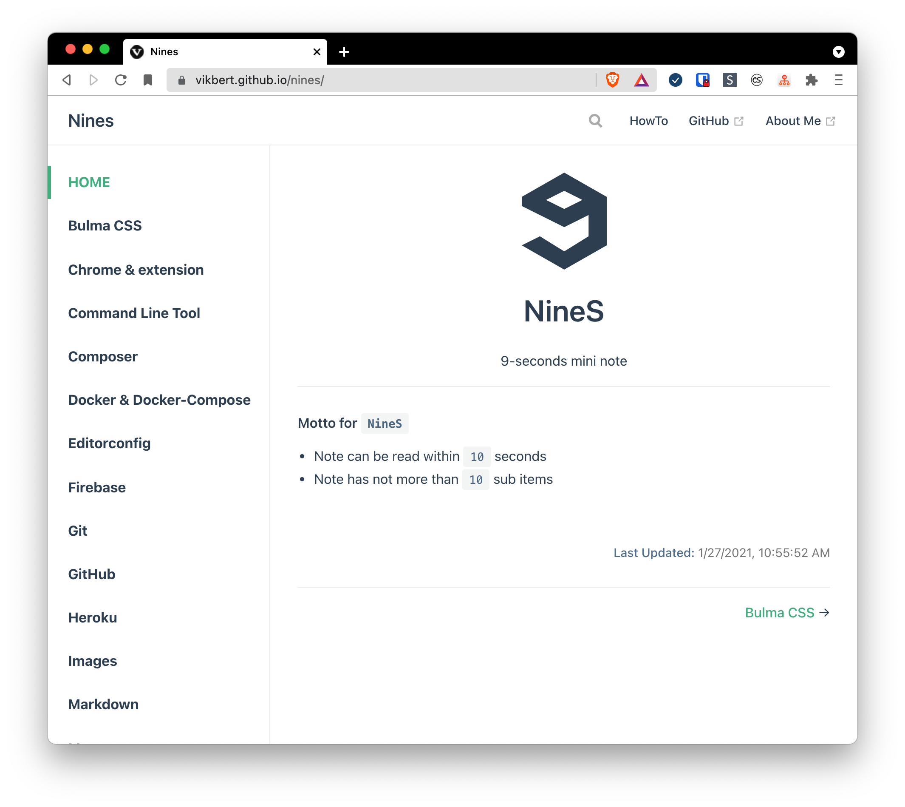

<div align="center">
  
  <h3>Nine Seconds</h3>
  <p>Short, but only the really useful tech notes</p>

  <p>
    <a href="#">
      
    </a>
    <a href="#">
      
    </a>
  </p>
</div>

---

## Install
```bash
npm install 
```


## Development
```bash
npm run start
```

## Build
```bash
bash deploy.sh
```

## licence

[MIT](./LICENSE) License © 2021 [@vikbert](https://vikbert.github.io/)
