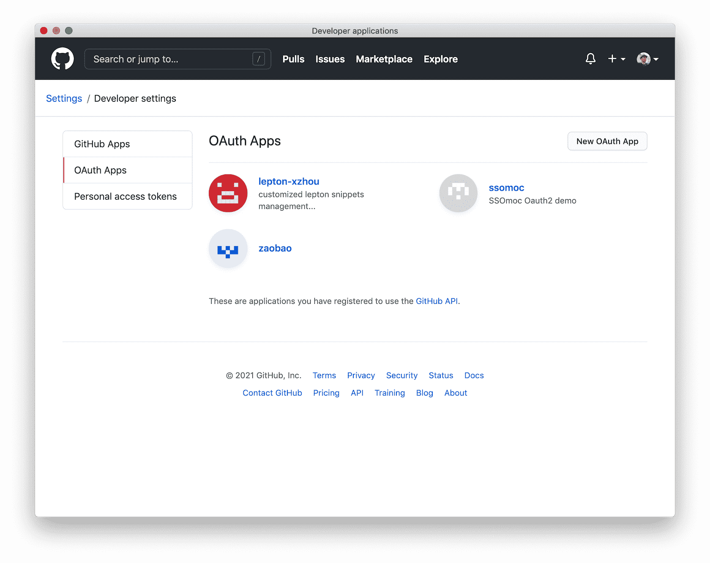

<div align="center">
    <span class="iconify" data-icon="bytesize:github" data-inline="false" width="100"></span>
</div>

<h2> Table of content </h2>

[[toc]]

## Create GitHub Package Icons
generate the package icons via <https://shields.io/>

Examples:

- 
- 
- 


## Create GitHub Repository via CLI `hub`

**install `hub` cli**

```bash
 brew install hub
 hub --help
 # enter the github `user` and `password`
```

**push local repo to remote github**

```bash
hub create myDemoRepo
git push --set-upstream origin master
```


## Create GitHub `Oauth2` App
First of all, create the `Oauth2 app` in the github account to get the `clientID` and `clientSecret`. 

To do this, go to `github.com` and select `setting` => `developer settings` => `OAuth Apps` => `New OAuth App`.





## Create GitHub pages
create the static pages under `https://vikbert.github.io/🔥new-blog🔥`

**create the repository on GitHub**
```bash
https://github.com/vikbert/new-blog.git
```

**push the local repository to gh-pages**
```bash
git push -f https://github.com/vikbert/new-blog.git master:gh-pages 
```

::: tip
Sub page URL: [https://vikbert.github.io/new-blog](#)
:::


